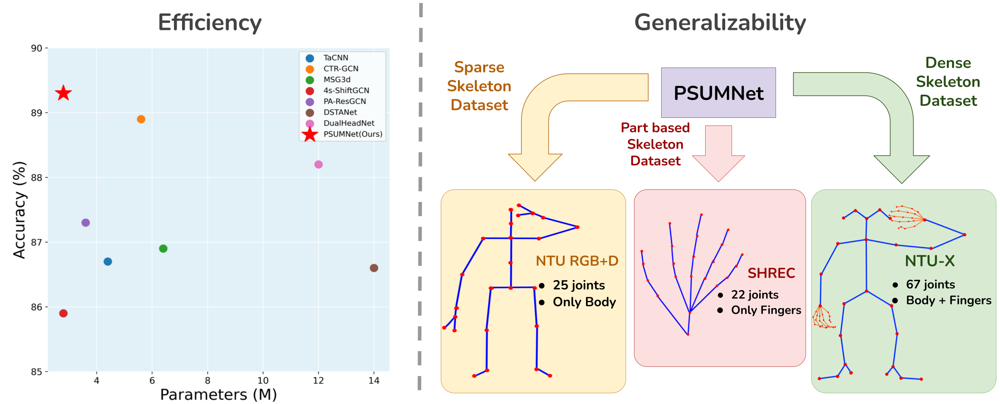
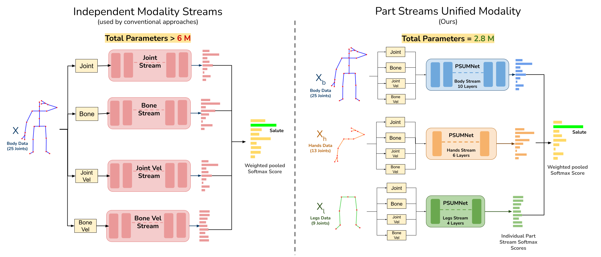
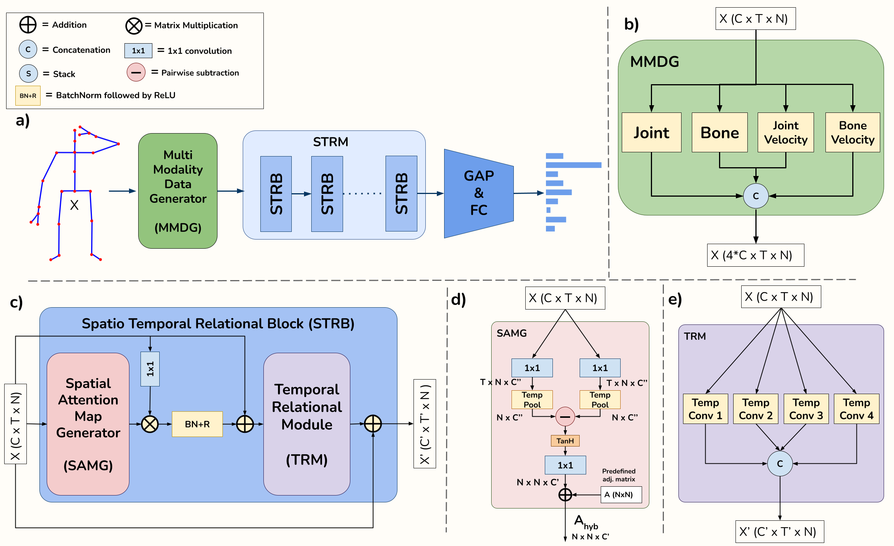

# PSUMNet: Unified Modality Part Streams are All You Need for Efficient Pose-based Action Recognition
Official pytorch implementation for PSUMNet for skeleton action recognition. Accepted at [ECCV 2022 WCPA](https://sites.google.com/view/wcpa2022/)



PSUMNet introduces unified modality part-based streaming approach compared to the conventional modality wise streaming approaches. This novel approach allows PSUMNet to achieve state of the art performance across skeleton action recognition datasets compared to competing methods which use around **100-400%** more parameters.




# Results

The following table compares the perfromance of PSUMNet with other existing methods on Cross Subject splits of [NTU60](https://github.com/shahroudy/NTURGB-D), [NTU120](https://github.com/shahroudy/NTURGB-D), [NTU60-X](https://github.com/skelemoa/ntu-x) and [NTU120-X](https://github.com/skelemoa/ntu-x) dataasets. 

<table>

<tr>
    <th>Model</th>
    <th># Params (M)</th>
    <th>FLOPs (G)</th>
    <th>NTU60</th>
    <th>NTU120</th>
    <th>NTU60-X</th>
    <th>NTU120-X</th>
</tr>

<tr>
    <td>PA-ResGCN</td>
    <td>3.6</td>
    <td>18.5</td>
    <td>90.9</td>
    <td>87.3</td>
    <td>91.6</td>
    <td>86.4</td>
</tr>

<tr>
    <td>MS-G3D</td>
    <td>6.4</td>
    <td>48.5</td>
    <td>91.5</td>
    <td>86.9</td>
    <td>91.8</td>
    <td>87.1</td>
</tr>

<tr>
    <td>4s ShiftGCN</td>
    <td>2.8</td>
    <td>10.0</td>
    <td>90.7</td>
    <td>85.9</td>
    <td>91.8</td>
    <td>86.2</td>
</tr>

<tr>
    <td>DSTA-Net</td>
    <td>14.0</td>
    <td>64.7</td>
    <td>91.5</td>
    <td>86.6</td>
    <td>93.6</td>
    <td>87.8</td>
</tr>

<tr>
    <td>CTR-GCN</td>
    <td>5.6</td>
    <td>7.6</td>
    <td>92.4</td>
    <td>88.9</td>
    <td>93.9</td>
    <td>88.3</td>
</tr>

<tr>
    <td><b>PSUMNet</b></td>
    <td><b>2.8</b></td>
    <td><b>2.7</b></td>
    <td><b>92.9</b></td>
    <td><b>89.4</b></td>
    <td><b>94.7</b></td>
    <td><b>89.1</b></td>
</tr>

</table>

<hr/>


### Training

## Sytem Requirements

Major requirements are as following,

- Python >= 3.6
- Pytorch >= 1.1.0

Rest of the requirements are specified in `requirements.txt` and can be installed using `pip install -r requirements.txt`. 

We trained our model using 4 1080Ti GPUs with 12 Gb RAM each.

## Data Preprocessing

We use the same data preprocessing for NTU60 and NTU120 datasets as given by [CTR-GCN](https://github.com/Uason-Chen/CTR-GCN). The path of the pre processed data needs to specified in the config file of that specific dataset.

## Config Files

`./config/` contains the configuration files for all the part based streams (i.e body.yaml, hand.yaml, leg.yaml) for NTU kinect and NTU-X dataset

## Training

Once the data and the config files are set, the model training can be started using the following command,

```
python main.py --config <path of the config file>
```

To use the model for inference using pre trained weights, use the following command,

```
python main.py --config <path of config file> --phase test --weights <path of pre trained weights>
```

Once the model is trained for all the part streams and thier scores are saved in .pkl files, you can use [ensemble.py](./ensemble.py) file to compute final accuracy by specifying path of these score files.


## Pretrained weights

<i>We will release the pre trained weights soon.</i>

## Acknowledgements

This work is inspired from [CTR-GCN](https://github.com/Uason-Chen/CTR-GCN). We thank authors of this repo for their valuable contribution.